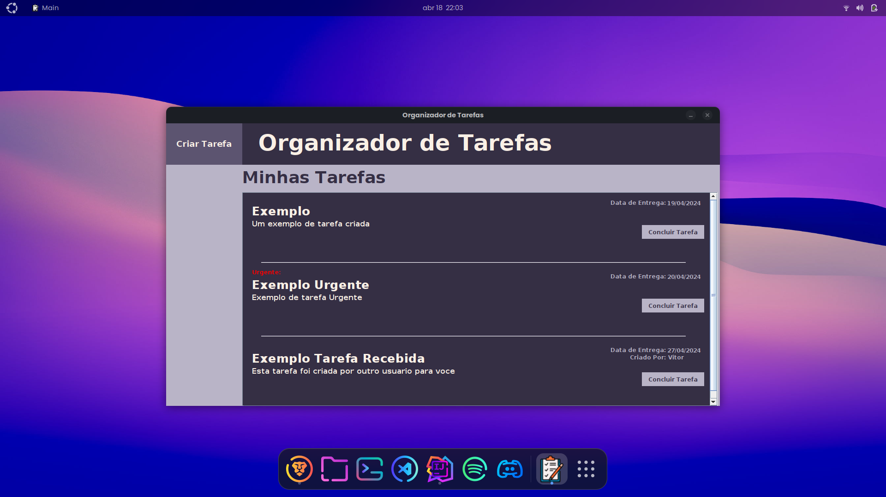

<p align="center">
</a>
</p>

## 📖 Descrição
* Projeto feito em Java e SQL
* Criador, Organizador e listagem de Tarefas

## 📷 Galeria


## 💻 Pré-requisitos
### Banco de Dados
Para criar um banco de dados valido utilize estas querys em seu postgres SQL

#### Pessoas:

```
CREATE TABLE pessoas (
    id SERIAL PRIMARY KEY,
    nome VARCHAR(100) NOT NULL,
    email VARCHAR(100) NOT NULL,
    senha VARCHAR(100) NOT NULL
);
```
#### Tarefas:
```
CREATE TABLE tarefas (
    id SERIAL PRIMARY KEY,
    titulo VARCHAR(255) NOT NULL,
    descricao TEXT NOT NULL,
    data_criado DATE NOT NULL,
    data_finalizada DATE NOT NULL,
    concluida BOOLEAN NOT NULL DEFAULT false,
    criador_id INTEGER,
    prioridade BOOLEAN,
    responsavel_id INTEGER,
    FOREIGN KEY (criador_id) REFERENCES pessoas(id),
    FOREIGN KEY (responsavel_id) REFERENCES pessoas(id)
);
```

## 🚀 Futuras Atualizações

Este projeto está sendo atualizado diariamente, com algumas metas:

- [x] Atualizar Tela Automaticamente
- [ ] Adicionar Notificações
- [x] Arrumar Listagem de Tarefas
- [ ] Refazer o Design das Telas
- [ ] Melhorar Interface
- [ ] Trazer mais Funcionalidades
- [ ] Arrumar Separator
- [ ] Arrumar Tamanho da Lista de Tarefas
- [x] Arrumar conclusao de tarefas


## 🤖 Tecnologias

 
